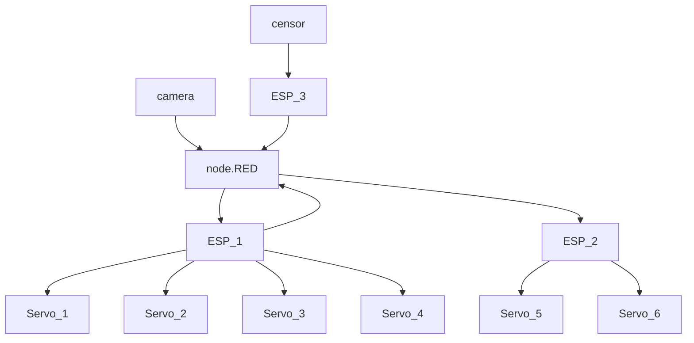

# 2023-m2cns-rd-ChaineDeValeurs


## Contexte
Le but de ce projet est de développer une solution basée sur des dispositifs connectés pour améliorer la gestion et le recyclage des produits de santé jetables.

Les quantités de produits plastiques utilisés dans les activités de santé, tels que les seringues, les poches de perfusion et les gants chirurgicaux, ont atteint plus de 36 milliards d'euros dans le monde en 2020 et devraient atteindre 55 milliards d'euros d'ici 2025, selon le Conseil de Recyclage des Plastiques de Santé. La plupart de ces produits sont éliminés dans des décharges ou incinérés, même si une partie importante est non contaminée et donc recyclable. Les solutions de dispositifs connectés ont le potentiel d'impact sur la chaîne de valeur de ces produits en améliorant leur manipulation tout en garantissant la sécurité et l'efficacité des processus.

La première étape consiste à mener une étude sur les domaines où les technologies de l'Internet des Objets (IoT) pourraient améliorer la manipulation des produits liés à la santé. Cela inclut des aspects tels que la gestion des stocks, les conteneurs de déchets intelligents, la gestion des déchets et la surveillance des conditions de stérilisation des équipements. Ensuite, nous somme chargé de concevoir et de mettre en œuvre une solution concrète basée sur des dispositifs connectés qui répond à l'un des domaines identifiés.

### Le flux de notre systeme ci-dessous:



Pour plus de détails, veuillez consulter le [rapport](./Docs/Rapport_V0.pdf) et la [présentation](./Docs/Presentation_V0.pdf).

## Installation et Configuration
[Expliquez comment installer et configurer votre solution technique. Vous pouvez faire référence à des readme.md spécifiques dans les sous-dossiers pour plus de détails.]

## Arduino

### Instructions d'installation du code Arduino

Le code fourni pour ce projet sera destiné à être utilisé sur trois cartes ESP32 distinctes, chacune remplissant un rôle spécifique dans le système de gestion des déchets de santé.

#### ESP1 - Gestion de la jetée des déchets
Ce code sera chargé sur la première carte ESP32 et sera responsable de la gestion de la jetée des déchets. Il s'occupera d'enclancher le mécanisme de jetée et de transmettre les informations nécessaires a la platform IoT.

#### ESP2 - Gestion de l'aiguillage
Sur la deuxième carte ESP32, le code sera chargé pour gérer l'aiguillage des déchets. Cette carte recevra les informations de la Platform IoT concernant le type de déchet jeté et dirigera ensuite le déchet vers le bon conteneur en fonction de sa catégorie.

#### ESP3 - Gestion de l'arrivée des déchets
Enfin, sur la troisième carte ESP32, le code sera chargé de gérer l'arrivée des déchets dans le réceptacle final. Cette carte s'assurera que les déchets sont correctement reçus et enregistrés dans le système.

### Configuration des branchements matériels

Les détails spécifiques sur la configuration des branchements matériels seront fournis dans le code Arduino de chaque ESP. Cependant, voici une vue d'ensemble générale des composants matériels nécessaires et de leur configuration typique :

- ESP1 : Actionneurs de jetée de déchets a base de servomoteurs.
- ESP2 : Aiguillage a l'aide de servomoteurs.
- ESP3 : Capteurs de détection Ultrason. 

Le code de chaque ESP sera fourni de manière générique, ce qui permettra aux utilisateurs de l'adapter en fonction de leur propre configuration matérielle et de leurs besoins spécifiques.

## Plateforme IoT avec Node-RED 

Nous avons mis en place une plateforme IoT basée sur Node-RED pour centraliser et gérer notre projet de gestion des déchets de santé. Cette plateforme permet de coordonner les différentes étapes du processus, depuis la détection et la classification des déchets jusqu'à leur traitement final.
### Fonctionnalités Principales :

-    Interface Visuelle Intuitive : Node-RED offre une interface visuelle intuitive, qui nous permet de créer et de gérer facilement les flux de données et les interactions entre les différents composants de notre système.

-    Intégration des Dispositifs IoT : Nous utilisons Node-RED pour intégrer les divers dispositifs IoT utilisés dans notre projet, tels que les capteurs de détection de déchets, les actionneurs d'aiguillage, les servomoteurs de la plateforme mobile, les caméras IP pour la prise de photos, et les ESP pour le contrôle des opérations.

-    Traitement des Données en Temps Réel : Node-RED nous permet de traiter les données en temps réel en provenance des capteurs et des caméras. Par exemple, nous utilisons des nœuds de traitement d'images pour analyser les photos des déchets et des nœuds de machine learning pour classifier les déchets en fonction de leur catégorie.

-    Gestion des Flux de Travail : Node-RED nous permet de définir et de gérer les flux de travail de notre système, en orchestrant les différentes étapes du processus de gestion des déchets. Par exemple, nous configurons des scénarios pour déclencher l'aiguillage des déchets en fonction de leur catégorie, et pour actionner la plateforme mobile pour le largage des déchets dans le réceptacle final.

### Utilisation dans notre Projet :

Dans notre projet, la plateforme Node-RED joue un rôle crucial dans la coordination des opérations de gestion des déchets de santé :

-    Détection et Classification des Déchets : Lorsqu'un déchet est déposé sur la plateforme mobile, une photo est prise à l'aide d'une caméra IP et analysée par notre modèle de machine learning. Node-RED orchestre ce processus en déclenchant la capture de la photo, l'analyse par le modèle ML, et la classification du déchet en fonction de sa catégorie.

-    Aiguillage des Déchets : Une fois que le déchet est classifié, Node-RED envoie un signal à l'ESP2 pour ajuster l'aiguillage en fonction de la catégorie du déchet.

-    Largage des Déchets : Après que l'aiguillage est en place, Node-RED envoie un signal à l'ESP1 pour actionner la plateforme mobile à l'aide de servomoteurs, permettant ainsi le largage du déchet dans le réceptacle final.

-    Traitement Final des Déchets : Le réceptacle final est équipé d'un capteur ultrasonique qui détecte le passage du déchet. Lorsque le déchet est détecté, l'ESP3 envoie un signal à la plateforme via Node-RED, indiquant que le déchet a été traité avec succès.


### Machine Learning
## Instructions pour la mise en place de l'environnement ML

### Prérequis
- Assurez-vous d'avoir Python 3.x installé sur votre machine.
- Installez la bibliothèque tensorflow à l'aide de la commande suivante :
    ```pip install tensorflow```

### Configuration de l'environnement de développement
- Clonez ce dépôt :
    ```git clone https://github.com/evry-paris-saclay/2023-m2cns-rd-ChaineDeValeurs.git```

- Ouvrez le fichier Jupyter Notebook ou le script Python dans votre environnement de développement, par exemple :
    ```jupyter notebook mon_notebook.ipynb```

- Modifiez le répertoire de données (data_dir) dans le script pour refléter le chemin vers votre jeu de données médicales.

Ces étapes devraient vous permettre de configurer l'environnement nécessaire pour exécuter le code sans problème.


## Configuration des données, des modèles ML, et des fonctions pour l'entraînement des modèles

### Chargement des données

- Assurez-vous que les images médicales sont organisées dans des répertoires par classe. Modifiez la variable `data_dir` dans le script pour pointer vers le répertoire racine de vos données.

### Prétraitement des images

- Les images sont redimensionnées à une taille de 100x100 pixels et normalisées entre 0 et 1.

### Division des données

- Les données sont divisées en ensembles d'entraînement, de validation et de test.

### Configuration du modèle

- Le modèle CNN est défini dans le script avec des couches de convolution, de pooling et de neurones denses. La dernière couche utilise une fonction d'activation softmax pour la classification multi-classes.

### Compilation du modèle

- L'optimiseur 'adam' et la fonction de perte 'sparse_categorical_crossentropy' sont utilisés pour la compilation du modèle.

### Entraînement du modèle

- Le modèle est entraîné avec 10 époques sur les données d'entraînement, en utilisant les données de validation pour le suivi.

### Évaluation du modèle

- Le modèle est évalué sur les données de test, et la précision du test est affichée.

### Sauvegarde et chargement du modèle

- Le modèle est sauvegardé au format h5 après l'entraînement. Vous pouvez charger le modèle sauvegardé ultérieurement à l'aide de la fonction de chargement.

### Prédiction sur une nouvelle image

- Utilisez le modèle entraîné pour prédire la classe d'une nouvelle image en ajustant le chemin d'accès de l'image dans la variable `img_path`.


## Fonctionnement du Système
[Décrivez le fonctionnement du système et montrez un exemple. Utilisez des images des branchements, des captures d'écran de la plateforme, etc. Une vidéo de démonstration bien scénarisée peut aussi être incluse.]

## Tests et Analyses de Performance
[Décrivez les tests effectués sur le système, y compris les KPIs (Key Performance Indicators). Discutez de la robustesse, de la précision, des performances, etc.]
## Encadrant
- Hamidi Massinissa
## Auteurs
- Laib Ramy
- Saraoui Keltouma


